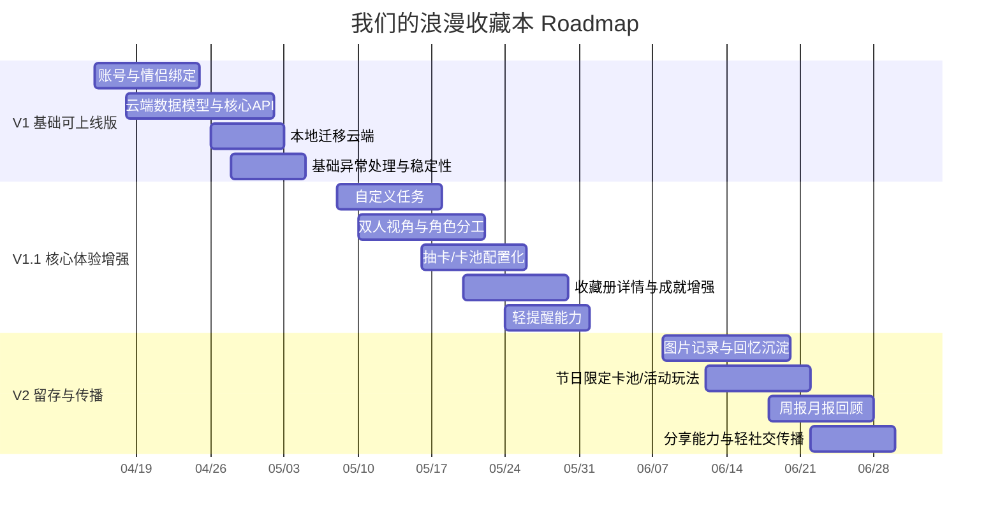

# 我们的浪漫收藏本 - 产品 Roadmap

## 一、版本路线图总览

---

## 二、表格版需求优先级与排期

| 模块 | 功能 | 优先级 | 建议排期 | 目标价值 | 关键卡点 | 需要提前准备 |
|---|---|---:|---|---|---|---|
| 账户体系 | 微信登录 / 用户唯一标识 | P0 | V1 第1周 | 建立线上身份体系，支持云端数据归属 | 小程序登录态、后端鉴权、union/openid 设计 | 确认登录方案、后端技术栈、测试环境 |
| 关系链路 | 情侣关系绑定（邀请码/确认绑定） | P0 | V1 第1-2周 | 从“单机产品”升级为“双人产品” | 绑定流程设计、解绑规则、重复绑定场景 | 关系模型、邀请码规则、异常场景清单 |
| 数据底座 | 云端数据库表设计 | P0 | V1 第1周 | 为任务/抽卡/收藏提供可持续存储 | 表结构是否支持扩展、数据一致性 | ER 图、字段定义、索引策略 |
| API 基础 | 核心 API：拉取状态/打卡/抽卡/收藏册 | P0 | V1 第2周 | 打通线上闭环 | 接口幂等性、抽卡一致性、防重复提交 | API 文档、错误码、鉴权方案 |
| 数据迁移 | 本地缓存迁移到云端 | P0 | V1 第3周 | 老用户不丢数据，平滑升级 | 本地旧数据兼容、冲突合并策略 | 迁移规则、回滚方案、灰度策略 |
| 稳定性 | 基础异常处理与降级兜底 | P0 | V1 第3-4周 | 降低线上故障感知 | 网络失败、登录失效、重复请求 | 错误提示规范、日志方案、重试策略 |
| 任务系统 | 自定义任务 | P1 | V1.1 第1周 | 提升长期可玩性与适配不同情侣习惯 | 任务配置边界、滥用与复杂度失控 | 任务字段设计、创建规则、编辑删除交互 |
| 双人体验 | 双人视角与角色分工 | P1 | V1.1 第1-2周 | 强化“我们”的关系感 | 展示逻辑复杂、角色心智不清 | 角色定义、页面信息架构、文案语气 |
| 抽卡系统 | 卡池配置化 / 概率配置 | P1 | V1.1 第2周 | 便于活动运营和后续扩展 | 概率透明度、后台配置准确性 | 卡池模型、概率策略、测试样例 |
| 收藏体验 | 收藏册详情增强 / 成就体系增强 | P1 | V1.1 第2-3周 | 提升情绪价值与收集感 | 内容产出成本、信息层级 | 卡片详情字段、成就规则、内容模板 |
| 留存机制 | 每日提醒 / 轻通知 | P1 | V1.1 第3周 | 提升回访率与互动频次 | 提醒过强会像催办工具 | 提醒触发策略、文案规范、频控方案 |
| 回忆记录 | 图片上传记录瞬间 | P2 | V2 第1周 | 把打卡变成回忆沉淀 | 存储成本、审核与上传体验 | 对象存储方案、图片压缩、上传失败兜底 |
| 活动运营 | 节日限定卡池 / 活动玩法 | P2 | V2 第1-2周 | 增加新鲜感与节日氛围 | 活动策划成本、配置复杂度 | 节日活动日历、卡面内容、活动配置机制 |
| 数据回顾 | 周报 / 月报回顾 | P2 | V2 第2周 | 强化陪伴感与累计价值 | 统计口径、文案表达 | 统计维度、模板、生成时机 |
| 传播能力 | 分享成就 / 分享卡片 | P2 | V2 第2-3周 | 提升情侣间互动与轻传播 | 分享场景是否自然、样式适配 | 分享素材模板、海报样式、分享链路 |
| 轻社交 | 排行榜 / PK（谨慎） | P3 | 暂缓 | 可探索外部传播和游戏化 | 容易偏离“浪漫初心”，变考核感 | 先验证用户是否真需要，再决定是否做 |
| AI 增强 | AI 生成浪漫任务/文案 | P3 | 暂缓 | 增强惊喜感和内容供给 | 成本、效果稳定性、内容质量 | Prompt 设计、内容审核、触发场景 |

---

## 三、建议排期节奏

| 阶段 | 时间 | 核心目标 | 产出 |
|---|---|---|---|
| V1 | 3~4 周 | 让产品从本地 MVP 变成“可上线的双人产品” | 登录、绑定、云端存储、核心 API、数据迁移、异常兜底 |
| V1.1 | 2~3 周 | 提升情侣使用体验和长期可玩性 | 自定义任务、双人视角、卡池配置化、收藏增强、提醒 |
| V2 | 3 周左右 | 做留存和传播，提升回忆价值 | 图片记录、节日玩法、回顾、分享 |

---

## 四、关键前置准备清单

### V1 上线前必须准备
1. 后端技术选型（Node / Java / Python / 云开发）
2. 数据库选型（MySQL / PostgreSQL）
3. 账号鉴权方案
4. 测试环境 + 正式环境区分
5. 接口域名与微信后台合法域名配置
6. 数据迁移方案
7. 基础埋点与错误日志方案

### V1.1 前建议准备
1. 后台配置能力（至少可配置任务/卡池）
2. 文案体系与内容模板
3. 成就规则清单
4. 通知频控策略

### V2 前建议准备
1. 图片存储与访问策略
2. 节日运营日历
3. 分享物料模板
4. 数据回顾统计口径

---

## 五、产品判断原则

1. **优先做“关系感增强”而不是“考核感增强”**
2. **优先做“数据可持续”而不是“功能堆积”**
3. **优先做“情侣间的小惊喜”而不是“公开竞争”**
4. **任何提醒、排行榜、PK，都要防止产品变味**
